Bamazon

In this repository, Bamazon has been built to allow users the ability to create and maintain a marketplace using Node.js and MySQL.

Part I - Customer View

In Part I, a database (bamazon) has been created using MySQL to keep track of inventory.  The Id number, product name, department name, price and stock quantity for each product will be maintained in the bamazon database.  A node application, bamazonCustomer.js, has been created to allow customers to purchase items based on availability.  The bamazon database will be updated after purchases are completed.

Below is an image of the schema used to create the database using MySQL:
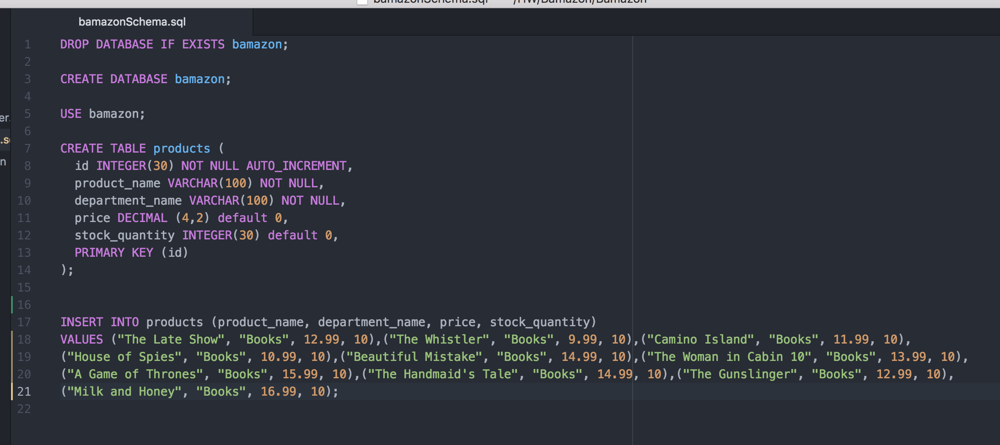

The following is an image of the products table that was created using the above schema:
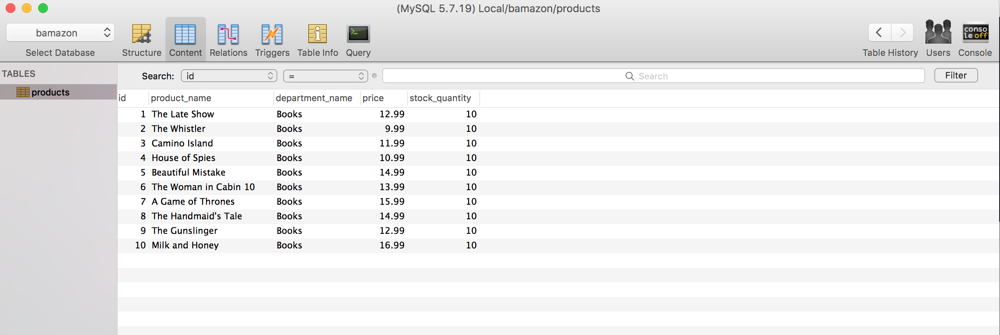

This is a print screen of a purchase made in the bash terminal (triggered by running command: node bamazon.js):
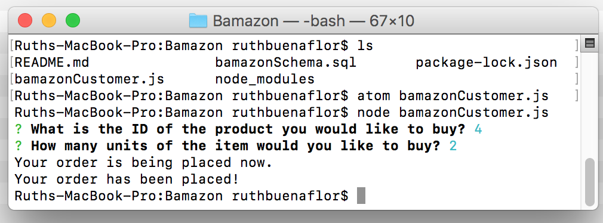

Below is an image of the updated table after the purchase above was made (Note: The units for Item id 4 was updated to 8 based on the purchase of 2 units):
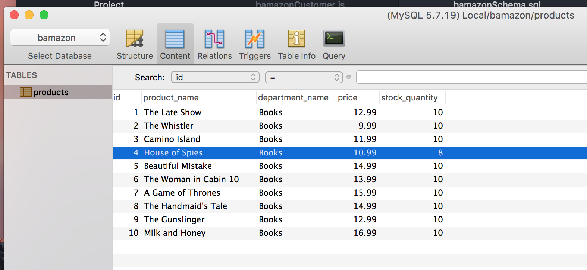

Below is a screen shot in the terminal where the user is attempting to buy more units than what is available in inventory:
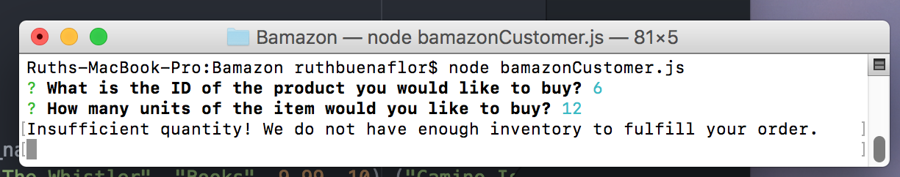

Part II - Manager View

In Part II, users have the ability to choose between options of viewing products, viewing low inventory, and adding new products using Node application, bamazonManager.js:

* View Products for Sale
* View Low Inventory
* Add New Products

Below is a screen shot from the bash terminal (triggered by running: node bamazonManager.js):
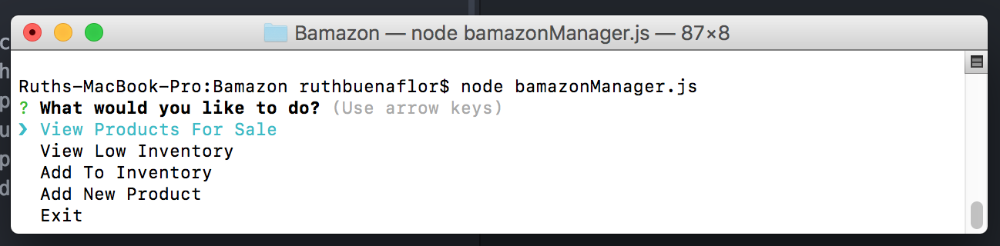

The following will appear when users select View Products for Sale:
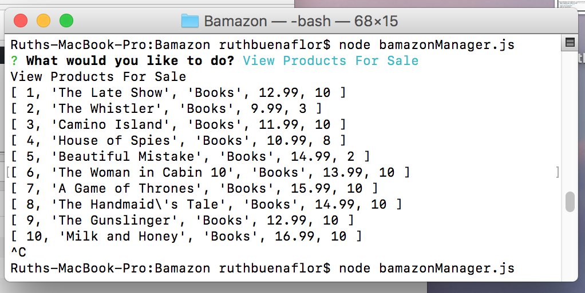

Users will view the following in the CLI when selecting View Low Inventory:
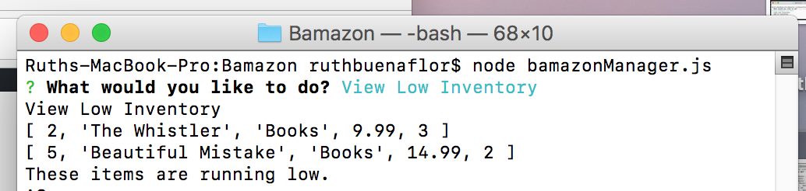

Below is a sampling of a user that has added a new product to the marketplace as well as an updated view of the MySQL database showing the new product:
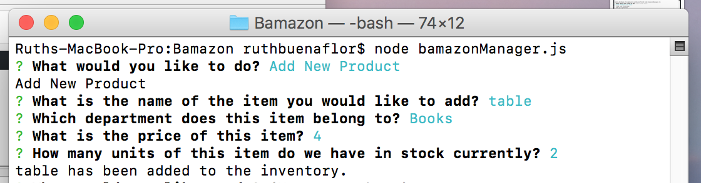
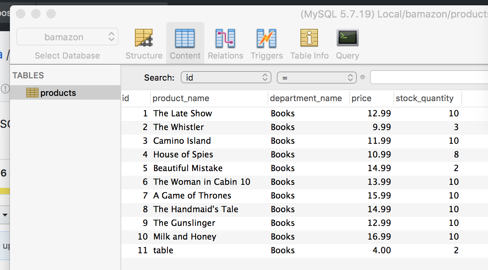

Users may exit the CLI by selecting the Exti option:
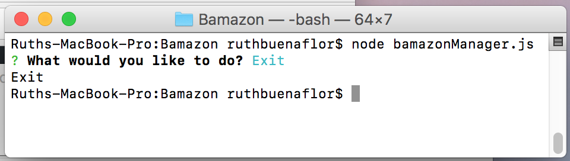
